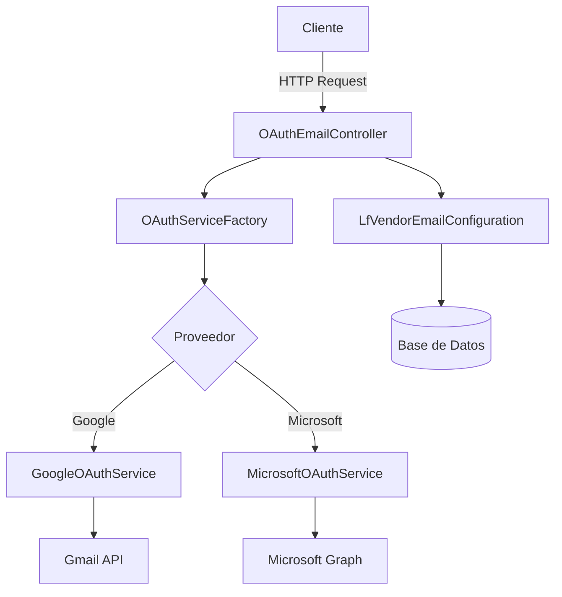

# OAuth Email API

<div align="center">


[](https://php.net)
[](https://laravel.com)
[](LICENSE)
[](https://github.com/JavierVaronBueno/oauth-email-api)

**API RESTful para autenticación OAuth2.0 y envío de correos electrónicos**

[🔑 Credenciales OAuth Requeridas](#CredencialesOAuthRequeridas) • [🚀 Instalación](#instalación) • [🔧 API Reference](#endpoints-de-la-api) • [🤝 Contribuir](#contribuir)

</div>

---

## 🌟 Características

**OAuth Email API** es una potente API RESTful desarrollada en **Laravel** que integra autenticación OAuth2.0 con los principales proveedores de correo electrónico. Diseñada con arquitectura modular y siguiendo los mejores estándares de desarrollo.

### ✨ Funcionalidades Principales

- 🔐 **Autenticación OAuth2.0** - Soporte completo para Google Gmail API y Microsoft Graph API
- 📧 **Envío de Correos Avanzado** - HTML, texto plano, CC, BCC y gestión de destinatarios
- 🔄 **Gestión Inteligente de Tokens** - Renovación automática y revocación segura
- 👤 **Información de Usuario** - Obtención de perfiles de usuarios autenticados
- ⚙️ **Configuración Dinámica** - Gestión de múltiples configuraciones de proveedores
- 🛡️ **Seguridad Robusta** - Validaciones estrictas y manejo de excepciones personalizadas
- 📊 **Logging Completo** - Trazabilidad de eventos y errores para depuración
- 🏗️ **Arquitectura Escalable** - Patrones Factory y Service para fácil extensión

### 🔧 Tecnologías y Patrones

- **Patrones de Diseño**: Factory Pattern, Service Layer Pattern
- **Estándares**: PSR-12 Code Style
- **Base de Datos**: MySQL con Eloquent ORM
- **HTTP Client**: Guzzle para comunicación con APIs
- **Manejo de Fechas**: Carbon para operaciones temporales

---

## 📋 Prerrequisitos

Antes de comenzar, asegúrate de tener instalado:

- **PHP** >= 7.4 con extensiones: `curl`, `json`, `mbstring`, `openssl`
- **Composer** >= 2.0
- **MySQL** >= 5.7 o **MariaDB** >= 10.2
- **Servidor Web** (Apache/Nginx) o usar servidor integrado de PHP

### 🔑 Credenciales OAuth Requeridas

#### Google Cloud Console
1. Ve a [Google Cloud Console](https://console.cloud.google.com/)
2. Crea un proyecto o selecciona uno existente
3. Habilita la **Gmail API**
4. Crea credenciales OAuth 2.0
5. Configura el URI de redirección autorizado

#### Microsoft Azure Portal  
1. Ve a [Azure Portal](https://portal.azure.com/)
2. Registra una nueva aplicación en Azure AD
3. Habilita **Microsoft Graph API** con permisos:
   - `Mail.Send`
   - `User.Read` 
4. Genera un secreto de cliente
5. Configura el URI de redirección

---

## 🚀 Instalación

### Instalación Rápida

```bash
# Clonar el repositorio
git clone https://github.com/JavierVaronBueno/oauth-email-api.git
cd oauth-email-api

# Instalar dependencias
composer install

# Configurar entorno
cp .env.example .env
php artisan key:generate

# Configurar base de datos (editar .env con tus credenciales)
php artisan migrate

# Iniciar servidor de desarrollo
php artisan serve
```

### Configuración Detallada

#### 1. **Configuración de Base de Datos**

Edita el archivo `.env`:

```env
DB_CONNECTION=mysql
DB_HOST=127.0.0.1
DB_PORT=3306
DB_DATABASE=oauth_email_api
DB_USERNAME=tu_usuario
DB_PASSWORD=tu_contraseña
```

#### 2. **Configuración de Zona Horaria**

```env
APP_TIMEZONE=America/Bogota
```

#### 3. **Configuración de Logging** (Opcional)

```env
LOG_CHANNEL=daily
LOG_LEVEL=debug
```
---

## 🏗️ Arquitectura del Proyecto

```
📁 app/
├── 📁 Contracts/
│   └── 📄 OAuthServiceInterface.php      # Interfaz para servicios OAuth
├── 📁 Exceptions/
│   ├── 📄 OAuthException.php            # Manejo de errores OAuth
│   └── 📄 EmailException.php            # Manejo de errores de email
├── 📁 Factories/
│   └── 📄 OAuthServiceFactory.php       # Factory para instanciar servicios
├── 📁 Http/Controllers/
│   └── 📄 OAuthEmailController.php      # Controlador principal de la API
├── 📁 Models/
│   └── 📄 LfVendorEmailConfiguration.php # Modelo de configuración
├── 📁 Providers/
│   └── 📄 OAuthServiceProvider.php      # Service Provider personalizado
└── 📁 Services/
    ├── 📄 GoogleOAuthService.php        # Servicio para Google API
    └── 📄 MicrosoftOAuthService.php     # Servicio para Microsoft Graph
```

### 🔄 Flujo de Arquitectura



---

## 🔧 Endpoints de la API

Base URL: `http://localhost:8000/api/oauth`

### 📝 Crear Configuración

**POST** `/configuration`

Registra una nueva configuración de proveedor de correo.

<details>
<summary><strong>Ver detalles del endpoint</strong></summary>

**Request Body:**
```json
{
    "vec_vendor_id": 1,
    "vec_location_id": 2,
    "vec_user_email": "user@example.com",
    "vec_provider_api": "google",
    "vec_client_id": "your-google-client-id.apps.googleusercontent.com",
    "vec_client_secret": "your-client-secret",
    "vec_redirect_uri": "https://yourapp.com/callback",
    "vec_tenant_id": "common"
}
```

**Response (201 Created):**
```json
{
    "success": true,
    "message": "Configuración almacenada exitosamente",
    "data": {
        "uid": 1,
        "provider": "google",
        "vendor_id": 1,
        "location_id": 2,
        "user_email": "user@example.com",
        "tenant_id": "common",
        "created_at": "2025-07-22T05:50:00.000000Z"
    }
}
```

**Validaciones:**
- `vec_vendor_id`: Requerido, entero
- `vec_location_id`: Requerido, entero  
- `vec_user_email`: Requerido, formato email válido
- `vec_provider_api`: Requerido, valores: `google`, `microsoft`
- `vec_client_id`: Requerido, string
- `vec_client_secret`: Requerido, string
- `vec_redirect_uri`: Requerido, URL válida
- `vec_tenant_id`: Opcional, default: `common`

</details>

### 🔗 Obtener URL de Autorización

**GET** `/auth-url?uid={configuration_id}`

Genera la URL de autorización OAuth2.0 para iniciar el flujo de autenticación.

<details>
<summary><strong>Ver detalles del endpoint</strong></summary>

**Query Parameters:**
- `uid`: ID de la configuración (requerido)

**Example:** `/auth-url?uid=1`

**Response (200 OK):**
```json
{
    "success": true,
    "data": {
        "auth_url": "https://accounts.google.com/o/oauth2/v2/auth?response_type=code&client_id=your-client-id&redirect_uri=https%3A//yourapp.com/callback&scope=https%3A//www.googleapis.com/auth/gmail.send+https%3A//www.googleapis.com/auth/userinfo.email&access_type=offline&prompt=consent&state=eyJ1aWQiOjEsImNzcmZfdG9rZW4iOiJhYmMxMjMifQ%3D%3D",
        "provider": "google",
        "uid": 1
    }
}
```

**Scopes incluidos:**
- **Google**: `gmail.send`, `userinfo.email`, `userinfo.profile`
- **Microsoft**: `Mail.Send`, `User.Read`, `offline_access`

</details>

### ✅ Callback OAuth

**GET** `/callback/{uid}?code={auth_code}&state={state_token}`

Procesa el callback de OAuth2.0 y obtiene los tokens de acceso.

<details>
<summary><strong>Ver detalles del endpoint</strong></summary>

**Path Parameters:**
- `uid`: ID de la configuración

**Query Parameters:**
- `code`: Código de autorización de OAuth
- `state`: Token de estado para validación CSRF

**Example:** `/callback/1?code=4/0AX4XfWi...&state=eyJ1aWQiOjF9`

**Response (200 OK):**
```json
{
    "success": true,
    "message": "Autenticación completada exitosamente",
    "data": {
        "provider": "google",
        "user_email": "user@example.com",
        "expires_at": "2025-07-22T06:50:00.000000Z",
        "uid": 1
    }
}
```

**Proceso interno:**
1. Validación del token `state` (protección CSRF)
2. Intercambio del código por tokens de acceso
3. Almacenamiento seguro de tokens en base de datos
4. Obtención de información básica del usuario

</details>

### 📬 Enviar Correo Electrónico

**POST** `/send-email`

Envía correos electrónicos a través del proveedor configurado.

<details>
<summary><strong>Ver detalles del endpoint</strong></summary>

**Request Body:**
```json
{
    "uid": 1,
    "to": "recipient@example.com",
    "subject": "Asunto del correo electrónico",
    "contentType": "HTML",
    "content": "<h1>¡Hola!</h1><p>Este es un correo de prueba con <strong>formato HTML</strong>.</p>",
    "cc": ["cc1@example.com", "cc2@example.com"],
    "bcc": ["bcc1@example.com"]
}
```

**Response (200 OK):**
```json
{
    "success": true,
    "message": "Correo enviado exitosamente",
    "data": {
        "provider": "google",
        "to": "recipient@example.com",
        "subject": "Asunto del correo electrónico",
        "sent_at": "2025-07-22T05:50:00.000000Z",
        "message_id": "CADnq1uFg...@mail.gmail.com"
    }
}
```

**Validaciones:**
- `uid`: Requerido, debe existir en configuraciones
- `to`: Requerido, email válido
- `subject`: Requerido, máximo 255 caracteres
- `contentType`: Opcional, valores: `HTML`, `TEXT` (default: `HTML`)
- `content`: Requerido, contenido del mensaje
- `cc`: Opcional, array de emails válidos (máximo 10)
- `bcc`: Opcional, array de emails válidos (máximo 10)

**Características:**
- Soporte para HTML y texto plano
- Validación de límites de destinatarios
- Detección automática de tokens expirados
- Renovación automática de tokens cuando es necesario

</details>

### 🔄 Renovar Token

**POST** `/refresh-token`

Renueva un token de acceso expirado usando el refresh token.

<details>
<summary><strong>Ver detalles del endpoint</strong></summary>

**Request Body:**
```json
{
    "uid": 1
}
```

**Response (200 OK):**
```json
{
    "success": true,
    "message": "Token renovado exitosamente",
    "data": {
        "provider": "google",
        "expires_at": "2025-07-22T06:50:00.000000Z",
        "uid": 1
    }
}
```

**Casos de uso:**
- Token de acceso expirado
- Mantenimiento proactivo de sesiones
- Integración con sistemas de renovación automática

</details>

### 🗑️ Revocar Token

**POST** `/revoke-token`

Revoca los tokens de acceso del usuario, cerrando la sesión OAuth.

<details>
<summary><strong>Ver detalles del endpoint</strong></summary>

**Request Body:**
```json
{
    "uid": 1
}
```

**Response (200 OK):**
```json
{
    "success": true,
    "message": "Token revocado exitosamente",
    "data": {
        "provider": "google",
        "uid": 1,
        "revoked_at": "2025-07-22T05:50:00.000000Z"
    }
}
```

**Proceso:**
1. Revocación en el servidor del proveedor
2. Eliminación de tokens de la base de datos
3. Invalidación de sesiones activas

</details>

### 👤 Información del Usuario

**GET** `/user-info?uid={configuration_id}`

Obtiene información del perfil del usuario autenticado.

<details>
<summary><strong>Ver detalles del endpoint</strong></summary>

**Query Parameters:**
- `uid`: ID de la configuración

**Response (200 OK):**
```json
{
    "success": true,
    "data": {
        "provider": "google",
        "user_info": {
            "id": "123456789012345678901",
            "email": "user@example.com",
            "verified_email": true,
            "name": "Juan Pérez",
            "given_name": "Juan",
            "family_name": "Pérez",
            "picture": "https://lh3.googleusercontent.com/a/...",
            "locale": "es"
        },
        "uid": 1
    }
}
```

**Información disponible:**
- **Google**: ID, email, nombre, foto de perfil, idioma
- **Microsoft**: ID, email, nombre para mostrar, nombre de usuario

</details>

---

## ⚠️ Manejo de Errores

La API utiliza un sistema robusto de manejo de errores con códigos HTTP estándar y mensajes descriptivos.

### Estructura de Respuesta de Error

```json
{
    "error": true,
    "message": "Descripción del error",
    "error_type": "tipo_de_error",
    "http_code": 400,
    "errors": {
        "campo": ["Detalle específico del error"]
    },
    "timestamp": "2025-07-22T05:50:00.000000Z"
}
```

### Tipos de Errores Comunes

| Código | Tipo | Descripción |
|--------|------|-------------|
| `400` | `validation_error` | Datos de entrada inválidos |
| `401` | `oauth_error` | Token inválido o expirado |
| `403` | `permission_error` | Permisos insuficientes |
| `404` | `not_found` | Configuración no encontrada |
| `429` | `rate_limit_error` | Límite de tasa excedido |
| `500` | `email_error` | Error en el envío de correo |
| `503` | `service_unavailable` | Servicio del proveedor no disponible |

### Ejemplos de Errores

**Validación de entrada:**
```json
{
    "error": true,
    "message": "Los datos proporcionados no son válidos",
    "error_type": "validation_error",
    "http_code": 422,
    "errors": {
        "vec_user_email": ["El campo vec_user_email debe ser una dirección de correo válida"],
        "vec_provider_api": ["El campo vec_provider_api debe ser google o microsoft"]
    }
}
```

**Token expirado:**
```json
{
    "error": true,
    "message": "El token de acceso ha expirado",
    "error_type": "oauth_error",
    "http_code": 401,
    "suggestion": "Utilice el endpoint /refresh-token para obtener un nuevo token"
}
```

---

## 🔒 Seguridad

### Medidas de Seguridad Implementadas

- **🛡️ Protección CSRF**: Token `state` en flujos OAuth
- **🔐 Encriptación de Datos**: Campos sensibles encriptados en base de datos
- **⏰ Expiración de Tokens**: Tokens con tiempo de vida limitado
- **📝 Validación Estricta**: Validación de entrada en todos los endpoints
- **🚫 Ocultación de Datos**: Campos sensibles ocultos en respuestas JSON
- **📊 Auditoría**: Logging completo de operaciones sensibles

### Campos Protegidos

Los siguientes campos están automáticamente ocultos en las respuestas JSON:
- `vec_client_secret`
- `vec_access_token` 
- `vec_refresh_token`

### Recomendaciones de Seguridad

1. **Usar HTTPS en producción** para todas las comunicaciones
2. **Implementar rate limiting** para prevenir abuso
3. **Agregar middleware de autenticación** (`auth:api`) en producción
4. **Rotar secretos de cliente** periódicamente
5. **Monitorear logs** para detectar actividad sospechosa
6. **Configurar CORS** apropiadamente para tu dominio

---

## 🗄️ Base de Datos

### Modelo de Datos Principal

La tabla `lf_vendor_email_configuration` es el corazón del sistema:

```sql
CREATE TABLE IF NOT EXISTS `lf_vendor_email_configuration` (
    `uid` INT(8) NOT NULL AUTO_INCREMENT COMMENT 'Unique configuration identifier',
    `vec_vendor_id` INT(8) NOT NULL COMMENT 'Vendor ID',
    `vec_location_id` INT(8) NOT NULL COMMENT 'Associated location ID',
    `vec_user_email` VARCHAR(255) CHARACTER SET utf8mb4 COLLATE utf8mb4_unicode_ci DEFAULT NULL COMMENT 'Configured user email',
    `vec_provider_api` VARCHAR(255) CHARACTER SET utf8mb4 COLLATE utf8mb4_unicode_ci NOT NULL COMMENT 'Email API provider (microsoft or google)',
    `vec_client_id` TEXT CHARACTER SET utf8mb4 COLLATE utf8mb4_unicode_ci NOT NULL COMMENT 'API client ID',
    `vec_client_secret` TEXT CHARACTER SET utf8mb4 COLLATE utf8mb4_unicode_ci NOT NULL COMMENT 'API client secret',
    `vec_tenant_id` TEXT CHARACTER SET utf8mb4 COLLATE utf8mb4_unicode_ci DEFAULT NULL COMMENT 'API tenant ID',
    `vec_redirect_uri` VARCHAR(255) CHARACTER SET utf8mb4 COLLATE utf8mb4_unicode_ci NOT NULL COMMENT 'Redirect URI for authentication',
    `vec_access_token` TEXT CHARACTER SET utf8mb4 COLLATE utf8mb4_unicode_ci DEFAULT NULL COMMENT 'API access token',
    `vec_refresh_token` TEXT CHARACTER SET utf8mb4 COLLATE UTF8MB4_UNICODE_CI DEFAULT NULL COMMENT 'API refresh token',
    `vec_expires_in` INT DEFAULT NULL COMMENT 'Token validity duration in seconds',
    `vec_expires_at` TIMESTAMP DEFAULT NULL COMMENT 'Token expiration date and time',
    `TS_create` TIMESTAMP NULL DEFAULT NULL COMMENT 'Record creation date',
    `TS_update` TIMESTAMP NULL DEFAULT NULL COMMENT 'Record last update date',
    `del` TIMESTAMP NULL DEFAULT NULL COMMENT 'Record soft deletion date',
    PRIMARY KEY (`uid`)
) ENGINE=InnoDB DEFAULT CHARSET=utf8mb4 COLLATE=utf8mb4_unicode_ci;
```

### Migración de Laravel

```php
<?php

use Illuminate\Database\Migrations\Migration;
use Illuminate\Database\Schema\Blueprint;
use Illuminate\Support\Facades\Schema;

class CreateLfVendorEmailConfigurationTable extends Migration
{
    public function up()
    {
        Schema::create('lf_vendor_email_configuration', function (Blueprint $table) {
            $table->id('uid');
            $table->integer('vec_vendor_id')->index();
            $table->integer('vec_location_id')->index();
            $table->string('vec_user_email')->nullable()->index();
            $table->string('vec_provider_api', 50)->index();
            $table->string('vec_client_id');
            $table->text('vec_client_secret');
            $table->string('vec_tenant_id')->default('common')->nullable();
            $table->string('vec_redirect_uri', 500);
            $table->text('vec_access_token')->nullable();
            $table->text('vec_refresh_token')->nullable();
            $table->integer('vec_expires_in')->nullable();
            $table->timestamp('vec_expires_at')->nullable();
            $table->timestamp('TS_create')->nullable();
            $table->timestamp('TS_update')->nullable();
            $table->softDeletes('del');
            
            // Índices compuestos para optimización
            $table->index(['vec_vendor_id', 'vec_location_id'], 'idx_vendor_location');
        });
    }

    public function down()
    {
        Schema::dropIfExists('lf_vendor_email_configuration');
    }
}
```

---

## 🧪 Testing

### Configuración de Testing

El proyecto incluye un conjunto completo de pruebas unitarias y de integración.

#### Ejecutar Pruebas

```bash
# Todas las pruebas
php artisan test

# Pruebas con cobertura
php artisan test --coverage

# Pruebas específicas
php artisan test --filter OAuthEmailControllerTest

# Pruebas en paralelo
php artisan test --parallel
```

#### Ejemplo de Test

```php
<?php

namespace Tests\Feature;

use Illuminate\Foundation\Testing\RefreshDatabase;
use Tests\TestCase;
use App\Models\LfVendorEmailConfiguration;

class OAuthEmailControllerTest extends TestCase
{
    use RefreshDatabase;

    /** @test */
    public function it_can_store_oauth_configuration()
    {
        $data = [
            'vec_vendor_id' => 1,
            'vec_location_id' => 2,
            'vec_user_email' => 'test@example.com',
            'vec_provider_api' => 'google',
            'vec_client_id' => 'test-client-id',
            'vec_client_secret' => 'test-client-secret',
            'vec_redirect_uri' => 'https://example.com/callback',
            'vec_tenant_id' => 'common'
        ];

        $response = $this->postJson('/api/oauth/configuration', $data);

        $response->assertStatus(201)
                 ->assertJsonStructure([
                     'success',
                     'message', 
                     'data' => [
                         'uid',
                         'provider',
                         'vendor_id',
                         'location_id',
                         'user_email',
                         'tenant_id',
                         'created_at'
                     ]
                 ]);

        $this->assertDatabaseHas('lf_vendor_email_configuration', [
            'vec_vendor_id' => 1,
            'vec_location_id' => 2,
            'vec_provider_api' => 'google',
            'vec_user_email' => 'test@example.com'
        ]);
    }

    /** @test */
    public function it_validates_required_fields()
    {
        $response = $this->postJson('/api/oauth/configuration', []);

        $response->assertStatus(422)
                 ->assertJsonValidationErrors([
                     'vec_vendor_id',
                     'vec_location_id', 
                     'vec_user_email',
                     'vec_provider_api'
                 ]);
    }

    /** @test */
    public function it_can_send_email_with_valid_configuration()
    {
        // Crear configuración de prueba
        $config = LfVendorEmailConfiguration::factory()->create([
            'vec_provider_api' => 'google',
            'vec_access_token' => 'valid-token',
            'vec_expires_at' => now()->addHour()
        ]);

        // Mock del servicio Google
        $this->mock(GoogleOAuthService::class, function ($mock) {
            $mock->shouldReceive('sendEmail')->andReturn([
                'id' => 'message-123',
                'threadId' => 'thread-456'
            ]);
        });

        $emailData = [
            'uid' => $config->uid,
            'to' => 'recipient@example.com',
            'subject' => 'Test Subject',
            'content' => '<p>Test content</p>',
            'contentType' => 'HTML'
        ];

        $response = $this->postJson('/api/oauth/send-email', $emailData);

        $response->assertStatus(200)
                 ->assertJson([
                     'success' => true,
                     'message' => 'Correo enviado exitosamente'
                 ]);
    }
}
```

### Factories para Testing

```php
<?php

namespace Database\Factories;

use App\Models\LfVendorEmailConfiguration;
use Illuminate\Database\Eloquent\Factories\Factory;

class LfVendorEmailConfigurationFactory extends Factory
{
    protected $model = LfVendorEmailConfiguration::class;

    public function definition()
    {
        return [
            'vec_vendor_id' => $this->faker->numberBetween(1, 100),
            'vec_location_id' => $this->faker->numberBetween(1, 100),
            'vec_user_email' => $this->faker->safeEmail,
            'vec_provider_api' => $this->faker->randomElement(['google', 'microsoft']),
            'vec_client_id' => $this->faker->uuid,
            'vec_client_secret' => $this->faker->sha256,
            'vec_redirect_uri' => $this->faker->url,
            'vec_tenant_id' => 'common',
            'TS_create' => now(),
            'TS_update' => now(),
        ];
    }

    public function withTokens()
    {
        return $this->state(function (array $attributes) {
            return [
                'vec_access_token' => $this->faker->sha256,
                'vec_refresh_token' => $this->faker->sha256,
                'vec_expires_in' => 3600,
                'vec_expires_at' => now()->addHour(),
            ];
        });
    }

    public function google()
    {
        return $this->state(function (array $attributes) {
            return [
                'vec_provider_api' => 'google',
            ];
        });
    }

    public function microsoft()
    {
        return $this->state(function (array $attributes) {
            return [
                'vec_provider_api' => 'microsoft',
            ];
        });
    }
}
```
## Notas Adicionales

- **Zona Horaria**: La aplicación está configurada para usar `America/Bogota` como zona horaria por defecto.
- **Escalabilidad**: La clase `OAuthServiceFactory` permite registrar nuevos proveedores de correo mediante el método `registerProvider`.
- **Limitaciones**: Actualmente, la API no soporta adjuntos en correos electrónicos. Esto puede implementarse en futuras versiones.

## Contribuir

1. Haz un fork del repositorio.
2. Crea una rama para tu funcionalidad (`git checkout -b feature/nueva-funcionalidad`).
3. Realiza tus cambios y haz commit (`git commit -m "Añadir nueva funcionalidad"`).
4. Sube los cambios a tu fork (`git push origin feature/nueva-funcionalidad`).
5. Crea un Pull Request en GitHub.

Por favor, sigue las convenciones de código PSR-12 y agrega pruebas unitarias para nuevas funcionalidades.

## Licencia

Este proyecto está licenciado bajo la [Licencia MIT](https://mit-license.org/).

## Contacto

Si tienes preguntas o sugerencias, abre un issue en el repositorio o contáctame en [javoxdaemon@gmail.com](javoxdaemon@egmail.com).
