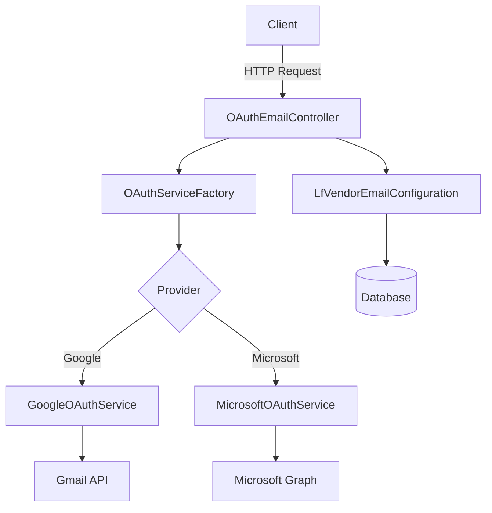

# OAuth Email API

<div align="center">


[](https://php.net)
[](https://laravel.com)
[](LICENSE)
[](https://github.com/JavierVaronBueno/oauth-email-api)

**RESTful API for OAuth2.0 authentication and email sending**

[🔑 Required OAuth Credentials](#required-oauth-credentials) • [🚀 Installation](#installation) • [🔧 API Reference](#api-endpoints) • [🤝 Contributing](#contributing)

</div>

---

## 🌟 Features

**OAuth Email API** is a powerful RESTful API developed in **Laravel** that integrates OAuth2.0 authentication with major email providers. Designed with modular architecture and following the best development standards.

### ✨ Main Features

- 🔐 **OAuth2.0 Authentication** - Full support for Google Gmail API and Microsoft Graph API
- 📧 **Advanced Email Sending** - HTML, plain text, CC, BCC, and recipient management
- 🔄 **Smart Token Management** - Automatic renewal and secure revocation
- 👤 **User Information** - Obtaining profiles of authenticated users
- ⚙️ **Dynamic Configuration** - Management of multiple provider configurations
- 🛡️ **Robust Security** - Strict validations and custom exception handling
- 📊 **Complete Logging** - Event and error traceability for debugging
- 🏗️ **Scalable Architecture** - Factory and Service patterns for easy extension

### 🔧 Technologies and Patterns

- **Design Patterns**: Factory Pattern, Service Layer Pattern
- **Standards**: PSR-12 Code Style
- **Database**: MySQL with Eloquent ORM
- **HTTP Client**: Guzzle for API communication
- **Date Handling**: Carbon for temporal operations

---

## 📋 Prerequisites

Before starting, make sure you have installed:

- **PHP** >= 7.4 with extensions: `curl`, `json`, `mbstring`, `openssl`
- **Composer** >= 2.0
- **MySQL** >= 5.7 or **MariaDB** >= 10.2
- **Web Server** (Apache/Nginx) or use PHP built-in server

### 🔑 Required OAuth Credentials

#### Google Cloud Console
1. Go to [Google Cloud Console](https://console.cloud.google.com/)
2. Create a project or select an existing one
3. Enable the **Gmail API**
4. Create OAuth 2.0 credentials
5. Configure the authorized redirect URI

#### Microsoft Azure Portal  
1. Go to [Azure Portal](https://portal.azure.com/)
2. Register a new application in Azure AD
3. Enable **Microsoft Graph API** with permissions:
   - `Mail.Send`
   - `User.Read` 
4. Generate a client secret
5. Configure the redirect URI

---

## 🚀 Installation

### Quick Installation

```bash
# Clone the repository
git clone https://github.com/JavierVaronBueno/oauth-email-api.git
cd oauth-email-api

# Install dependencies
composer install

# Configure environment
cp .env.example .env
php artisan key:generate

# Configure database (edit .env with your credentials)
php artisan migrate

# Start development server
php artisan serve
```

### Detailed Configuration

#### 1. **Database Configuration**

Edit the `.env` file:

```env
DB_CONNECTION=mysql
DB_HOST=127.0.0.1
DB_PORT=3306
DB_DATABASE=oauth_email_api
DB_USERNAME=your_username
DB_PASSWORD=your_password
```

#### 2. **Timezone Configuration**

```env
APP_TIMEZONE=America/Bogota
```

#### 3. **Logging Configuration** (Optional)

```env
LOG_CHANNEL=daily
LOG_LEVEL=debug
```
---

## 🏗️ Project Architecture

```
📁 app/
├── 📁 Contracts/
│   └── 📄 OAuthServiceInterface.php      # Interface for OAuth services
├── 📁 Exceptions/
│   ├── 📄 OAuthException.php            # OAuth error handling
│   └── 📄 EmailException.php            # Email error handling
├── 📁 Factories/
│   └── 📄 OAuthServiceFactory.php       # Factory to instantiate services
├── 📁 Http/Controllers/
│   └── 📄 OAuthEmailController.php      # Main API controller
├── 📁 Models/
│   └── 📄 LfVendorEmailConfiguration.php # Configuration model
├── 📁 Providers/
│   └── 📄 OAuthServiceProvider.php      # Custom Service Provider
└── 📁 Services/
    ├── 📄 GoogleOAuthService.php        # Service for Google API
    └── 📄 MicrosoftOAuthService.php     # Service for Microsoft Graph
```

### 🔄 Architecture Flow



---

## 🔧 API Endpoints

Base URL: `http://localhost:8000/api/oauth`

### 📝 Create Configuration

**POST** `/configuration`

Registers a new email provider configuration.

<details>
<summary><strong>View endpoint details</strong></summary>

**Request Body:**
```json
{
    "vec_vendor_id": 1,
    "vec_location_id": 2,
    "vec_user_email": "user@example.com",
    "vec_provider_api": "google",
    "vec_client_id": "your-google-client-id.apps.googleusercontent.com",
    "vec_client_secret": "your-client-secret",
    "vec_redirect_uri": "https://yourapp.com/callback",
    "vec_tenant_id": "common"
}
```

**Response (201 Created):**
```json
{
    "success": true,
    "message": "Configuration stored successfully",
    "data": {
        "uid": 1,
        "provider": "google",
        "vendor_id": 1,
        "location_id": 2,
        "user_email": "user@example.com",
        "tenant_id": "common",
        "created_at": "2025-07-22T05:50:00.000000Z"
    }
}
```

**Validations:**
- `vec_vendor_id`: Required, integer
- `vec_location_id`: Required, integer  
- `vec_user_email`: Required, valid email format
- `vec_provider_api`: Required, values: `google`, `microsoft`
- `vec_client_id`: Required, string
- `vec_client_secret`: Required, string
- `vec_redirect_uri`: Required, valid URL
- `vec_tenant_id`: Optional, default: `common`

</details>

### 🔗 Get Authorization URL

**GET** `/auth-url?uid={configuration_id}`

Generates the OAuth2.0 authorization URL to initiate the authentication flow.

<details>
<summary><strong>View endpoint details</strong></summary>

**Query Parameters:**
- `uid`: Configuration ID (required)

**Example:** `/auth-url?uid=1`

**Response (200 OK):**
```json
{
    "success": true,
    "data": {
        "auth_url": "https://accounts.google.com/o/oauth2/v2/auth?response_type=code&client_id=your-client-id&redirect_uri=https%3A//yourapp.com/callback&scope=https%3A//www.googleapis.com/auth/gmail.send+https%3A//www.googleapis.com/auth/userinfo.email&access_type=offline&prompt=consent&state=eyJ1aWQiOjEsImNzcmZfdG9rZW4iOiJhYmMxMjMifQ%3D%3D",
        "provider": "google",
        "uid": 1
    }
}
```

**Included scopes:**
- **Google**: `gmail.send`, `userinfo.email`, `userinfo.profile`
- **Microsoft**: `Mail.Send`, `User.Read`, `offline_access`

</details>

### ✅ OAuth Callback

**GET** `/callback/{uid}?code={auth_code}&state={state_token}`

Processes the OAuth2.0 callback and obtains access tokens.

<details>
<summary><strong>View endpoint details</strong></summary>

**Path Parameters:**
- `uid`: Configuration ID

**Query Parameters:**
- `code`: OAuth authorization code
- `state`: State token for CSRF validation

**Example:** `/callback/1?code=4/0AX4XfWi...&state=eyJ1aWQiOjF9`

**Response (200 OK):**
```json
{
    "success": true,
    "message": "Authentication completed successfully",
    "data": {
        "provider": "google",
        "user_email": "user@example.com",
        "expires_at": "2025-07-22T06:50:00.000000Z",
        "uid": 1
    }
}
```

**Internal process:**
1. Validation of `state` token (CSRF protection)
2. Exchange code for access tokens
3. Secure storage of tokens in database
4. Obtaining basic user information

</details>

### 📬 Send Email

**POST** `/send-email`

Sends emails through the configured provider.

<details>
<summary><strong>View endpoint details</strong></summary>

**Request Body:**
```json
{
    "uid": 1,
    "to": "recipient@example.com",
    "subject": "Email subject",
    "contentType": "HTML",
    "content": "<h1>Hello!</h1><p>This is a test email with <strong>HTML format</strong>.</p>",
    "cc": ["cc1@example.com", "cc2@example.com"],
    "bcc": ["bcc1@example.com"]
}
```

**Response (200 OK):**
```json
{
    "success": true,
    "message": "Email sent successfully",
    "data": {
        "provider": "google",
        "to": "recipient@example.com",
        "subject": "Email subject",
        "sent_at": "2025-07-22T05:50:00.000000Z",
        "message_id": "CADnq1uFg...@mail.gmail.com"
    }
}
```

**Validations:**
- `uid`: Required, must exist in configurations
- `to`: Required, valid email
- `subject`: Required, maximum 255 characters
- `contentType`: Optional, values: `HTML`, `TEXT` (default: `HTML`)
- `content`: Required, message content
- `cc`: Optional, array of valid emails (maximum 10)
- `bcc`: Optional, array of valid emails (maximum 10)

**Features:**
- Support for HTML and plain text
- Recipient limit validation
- Automatic expired token detection
- Automatic token renewal when necessary

</details>

### 🔄 Refresh Token

**POST** `/refresh-token`

Refreshes an expired access token using the refresh token.

<details>
<summary><strong>View endpoint details</strong></summary>

**Request Body:**
```json
{
    "uid": 1
}
```

**Response (200 OK):**
```json
{
    "success": true,
    "message": "Token refreshed successfully",
    "data": {
        "provider": "google",
        "expires_at": "2025-07-22T06:50:00.000000Z",
        "uid": 1
    }
}
```

**Use cases:**
- Expired access token
- Proactive session maintenance
- Integration with automatic renewal systems

</details>

### 🗑️ Revoke Token

**POST** `/revoke-token`

Revokes the user's access tokens, closing the OAuth session.

<details>
<summary><strong>View endpoint details</strong></summary>

**Request Body:**
```json
{
    "uid": 1
}
```

**Response (200 OK):**
```json
{
    "success": true,
    "message": "Token revoked successfully",
    "data": {
        "provider": "google",
        "uid": 1,
        "revoked_at": "2025-07-22T05:50:00.000000Z"
    }
}
```

**Process:**
1. Revocation on provider's server
2. Token deletion from database
3. Invalidation of active sessions

</details>

### 👤 User Information

**GET** `/user-info?uid={configuration_id}`

Obtains information from the authenticated user's profile.

<details>
<summary><strong>View endpoint details</strong></summary>

**Query Parameters:**
- `uid`: Configuration ID

**Response (200 OK):**
```json
{
    "success": true,
    "data": {
        "provider": "google",
        "user_info": {
            "id": "123456789012345678901",
            "email": "user@example.com",
            "verified_email": true,
            "name": "John Doe",
            "given_name": "John",
            "family_name": "Doe",
            "picture": "https://lh3.googleusercontent.com/a/...",
            "locale": "en"
        },
        "uid": 1
    }
}
```

**Available information:**
- **Google**: ID, email, name, profile picture, language
- **Microsoft**: ID, email, display name, username

</details>

---

## ⚠️ Error Handling

The API uses a robust error handling system with standard HTTP codes and descriptive messages.

### Error Response Structure

```json
{
    "error": true,
    "message": "Error description",
    "error_type": "error_type",
    "http_code": 400,
    "errors": {
        "field": ["Specific error detail"]
    },
    "timestamp": "2025-07-22T05:50:00.000000Z"
}
```

### Common Error Types

| Code | Type | Description |
|------|------|-------------|
| `400` | `validation_error` | Invalid input data |
| `401` | `oauth_error` | Invalid or expired token |
| `403` | `permission_error` | Insufficient permissions |
| `404` | `not_found` | Configuration not found |
| `429` | `rate_limit_error` | Rate limit exceeded |
| `500` | `email_error` | Email sending error |
| `503` | `service_unavailable` | Provider service unavailable |

### Error Examples

**Input validation:**
```json
{
    "error": true,
    "message": "The provided data is invalid",
    "error_type": "validation_error",
    "http_code": 422,
    "errors": {
        "vec_user_email": ["The vec_user_email field must be a valid email address"],
        "vec_provider_api": ["The vec_provider_api field must be google or microsoft"]
    }
}
```

**Expired token:**
```json
{
    "error": true,
    "message": "The access token has expired",
    "error_type": "oauth_error",
    "http_code": 401,
    "suggestion": "Use the /refresh-token endpoint to obtain a new token"
}
```

---

## 🔒 Security

### Implemented Security Measures

- **🛡️ CSRF Protection**: `state` token in OAuth flows
- **🔐 Data Encryption**: Sensitive fields encrypted in database
- **⏰ Token Expiration**: Tokens with limited lifetime
- **📝 Strict Validation**: Input validation on all endpoints
- **🚫 Data Hiding**: Sensitive fields hidden in JSON responses
- **📊 Auditing**: Complete logging of sensitive operations

### Protected Fields

The following fields are automatically hidden in JSON responses:
- `vec_client_secret`
- `vec_access_token` 
- `vec_refresh_token`

### Security Recommendations

1. **Use HTTPS in production** for all communications
2. **Implement rate limiting** to prevent abuse
3. **Add authentication middleware** (`auth:api`) in production
4. **Rotate client secrets** periodically
5. **Monitor logs** to detect suspicious activity
6. **Configure CORS** appropriately for your domain

---

## 🗄️ Database

### Main Data Model

The `lf_vendor_email_configuration` table is the heart of the system:

```sql
CREATE TABLE IF NOT EXISTS `lf_vendor_email_configuration` (
    `uid` INT(8) NOT NULL AUTO_INCREMENT COMMENT 'Unique configuration identifier',
    `vec_vendor_id` INT(8) NOT NULL COMMENT 'Vendor ID',
    `vec_location_id` INT(8) NOT NULL COMMENT 'Associated location ID',
    `vec_user_email` VARCHAR(255) CHARACTER SET utf8mb4 COLLATE utf8mb4_unicode_ci DEFAULT NULL COMMENT 'Configured user email',
    `vec_provider_api` VARCHAR(255) CHARACTER SET utf8mb4 COLLATE utf8mb4_unicode_ci NOT NULL COMMENT 'Email API provider (microsoft or google)',
    `vec_client_id` TEXT CHARACTER SET utf8mb4 COLLATE utf8mb4_unicode_ci NOT NULL COMMENT 'API client ID',
    `vec_client_secret` TEXT CHARACTER SET utf8mb4 COLLATE utf8mb4_unicode_ci NOT NULL COMMENT 'API client secret',
    `vec_tenant_id` TEXT CHARACTER SET utf8mb4 COLLATE utf8mb4_unicode_ci DEFAULT NULL COMMENT 'API tenant ID',
    `vec_redirect_uri` VARCHAR(255) CHARACTER SET utf8mb4 COLLATE utf8mb4_unicode_ci NOT NULL COMMENT 'Redirect URI for authentication',
    `vec_access_token` TEXT CHARACTER SET utf8mb4 COLLATE utf8mb4_unicode_ci DEFAULT NULL COMMENT 'API access token',
    `vec_refresh_token` TEXT CHARACTER SET utf8mb4 COLLATE UTF8MB4_UNICODE_CI DEFAULT NULL COMMENT 'API refresh token',
    `vec_expires_in` INT DEFAULT NULL COMMENT 'Token validity duration in seconds',
    `vec_expires_at` TIMESTAMP DEFAULT NULL COMMENT 'Token expiration date and time',
    `TS_create` TIMESTAMP NULL DEFAULT NULL COMMENT 'Record creation date',
    `TS_update` TIMESTAMP NULL DEFAULT NULL COMMENT 'Record last update date',
    `del` TIMESTAMP NULL DEFAULT NULL COMMENT 'Record soft deletion date',
    PRIMARY KEY (`uid`)
) ENGINE=InnoDB DEFAULT CHARSET=utf8mb4 COLLATE=utf8mb4_unicode_ci;
```

### Laravel Migration

```php
<?php

use Illuminate\Database\Migrations\Migration;
use Illuminate\Database\Schema\Blueprint;
use Illuminate\Support\Facades\Schema;

class CreateLfVendorEmailConfigurationTable extends Migration
{
    public function up()
    {
        Schema::create('lf_vendor_email_configuration', function (Blueprint $table) {
            $table->id('uid');
            $table->integer('vec_vendor_id')->index();
            $table->integer('vec_location_id')->index();
            $table->string('vec_user_email')->nullable()->index();
            $table->string('vec_provider_api', 50)->index();
            $table->string('vec_client_id');
            $table->text('vec_client_secret');
            $table->string('vec_tenant_id')->default('common')->nullable();
            $table->string('vec_redirect_uri', 500);
            $table->text('vec_access_token')->nullable();
            $table->text('vec_refresh_token')->nullable();
            $table->integer('vec_expires_in')->nullable();
            $table->timestamp('vec_expires_at')->nullable();
            $table->timestamp('TS_create')->nullable();
            $table->timestamp('TS_update')->nullable();
            $table->softDeletes('del');
            
            // Composite indexes for optimization
            $table->index(['vec_vendor_id', 'vec_location_id'], 'idx_vendor_location');
        });
    }

    public function down()
    {
        Schema::dropIfExists('lf_vendor_email_configuration');
    }
}
```

---

## 🧪 Testing

### Testing Configuration

The project includes a complete set of unit and integration tests.

#### Running Tests

```bash
# All tests
php artisan test

# Tests with coverage
php artisan test --coverage

# Specific tests
php artisan test --filter OAuthEmailControllerTest

# Parallel tests
php artisan test --parallel
```

#### Test Example

```php
<?php

namespace Tests\Feature;

use Illuminate\Foundation\Testing\RefreshDatabase;
use Tests\TestCase;
use App\Models\LfVendorEmailConfiguration;

class OAuthEmailControllerTest extends TestCase
{
    use RefreshDatabase;

    /** @test */
    public function it_can_store_oauth_configuration()
    {
        $data = [
            'vec_vendor_id' => 1,
            'vec_location_id' => 2,
            'vec_user_email' => 'test@example.com',
            'vec_provider_api' => 'google',
            'vec_client_id' => 'test-client-id',
            'vec_client_secret' => 'test-client-secret',
            'vec_redirect_uri' => 'https://example.com/callback',
            'vec_tenant_id' => 'common'
        ];

        $response = $this->postJson('/api/oauth/configuration', $data);

        $response->assertStatus(201)
                 ->assertJsonStructure([
                     'success',
                     'message', 
                     'data' => [
                         'uid',
                         'provider',
                         'vendor_id',
                         'location_id',
                         'user_email',
                         'tenant_id',
                         'created_at'
                     ]
                 ]);

        $this->assertDatabaseHas('lf_vendor_email_configuration', [
            'vec_vendor_id' => 1,
            'vec_location_id' => 2,
            'vec_provider_api' => 'google',
            'vec_user_email' => 'test@example.com'
        ]);
    }

    /** @test */
    public function it_validates_required_fields()
    {
        $response = $this->postJson('/api/oauth/configuration', []);

        $response->assertStatus(422)
                 ->assertJsonValidationErrors([
                     'vec_vendor_id',
                     'vec_location_id', 
                     'vec_user_email',
                     'vec_provider_api'
                 ]);
    }

    /** @test */
    public function it_can_send_email_with_valid_configuration()
    {
        // Create test configuration
        $config = LfVendorEmailConfiguration::factory()->create([
            'vec_provider_api' => 'google',
            'vec_access_token' => 'valid-token',
            'vec_expires_at' => now()->addHour()
        ]);

        // Mock Google service
        $this->mock(GoogleOAuthService::class, function ($mock) {
            $mock->shouldReceive('sendEmail')->andReturn([
                'id' => 'message-123',
                'threadId' => 'thread-456'
            ]);
        });

        $emailData = [
            'uid' => $config->uid,
            'to' => 'recipient@example.com',
            'subject' => 'Test Subject',
            'content' => '<p>Test content</p>',
            'contentType' => 'HTML'
        ];

        $response = $this->postJson('/api/oauth/send-email', $emailData);

        $response->assertStatus(200)
                 ->assertJson([
                     'success' => true,
                     'message' => 'Email sent successfully'
                 ]);
    }
}
```

### Factories for Testing

```php
<?php

namespace Database\Factories;

use App\Models\LfVendorEmailConfiguration;
use Illuminate\Database\Eloquent\Factories\Factory;

class LfVendorEmailConfigurationFactory extends Factory
{
    protected $model = LfVendorEmailConfiguration::class;

    public function definition()
    {
        return [
            'vec_vendor_id' => $this->faker->numberBetween(1, 100),
            'vec_location_id' => $this->faker->numberBetween(1, 100),
            'vec_user_email' => $this->faker->safeEmail,
            'vec_provider_api' => $this->faker->randomElement(['google', 'microsoft']),
            'vec_client_id' => $this->faker->uuid,
            'vec_client_secret' => $this->faker->sha256,
            'vec_redirect_uri' => $this->faker->url,
            'vec_tenant_id' => 'common',
            'TS_create' => now(),
            'TS_update' => now(),
        ];
    }

    public function withTokens()
    {
        return $this->state(function (array $attributes) {
            return [
                'vec_access_token' => $this->faker->sha256,
                'vec_refresh_token' => $this->faker->sha256,
                'vec_expires_in' => 3600,
                'vec_expires_at' => now()->addHour(),
            ];
        });
    }

    public function google()
    {
        return $this->state(function (array $attributes) {
            return [
                'vec_provider_api' => 'google',
            ];
        });
    }

    public function microsoft()
    {
        return $this->state(function (array $attributes) {
            return [
                'vec_provider_api' => 'microsoft',
            ];
        });
    }
}
```

## Additional Notes

- **Timezone**: The application is configured to use `America/Bogota` as the default timezone.
- **Scalability**: The `OAuthServiceFactory` class allows registering new email providers through the `registerProvider` method.
- **Limitations**: Currently, the API does not support email attachments. This can be implemented in future versions.

## Contributing

1. Fork the repository.
2. Create a branch for your feature (`git checkout -b feature/new-feature`).
3. Make your changes and commit (`git commit -m "Add new feature"`).
4. Push changes to your fork (`git push origin feature/new-feature`).
5. Create a Pull Request on GitHub.

Please follow PSR-12 code conventions and add unit tests for new features.

## License

This project is licensed under the [MIT License](https://mit-license.org/).

## Contact

If you have questions or suggestions, open an issue in the repository or contact me at [javoxdaemon@gmail.com](javoxdaemon@gmail.com).
